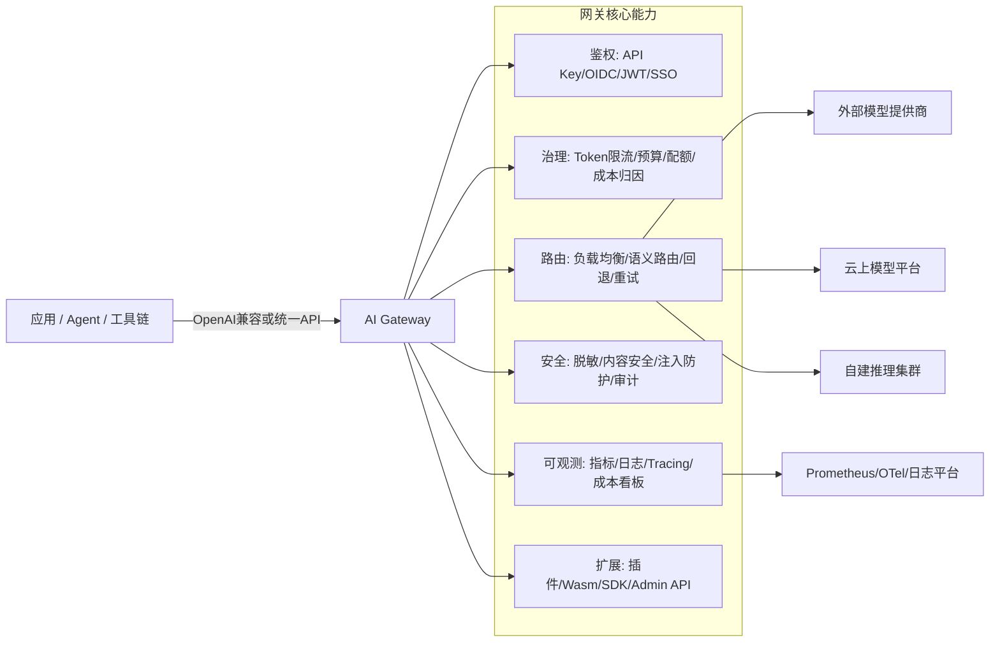

# AI Gateway（LLM API 网关）产品选型深度研究：类 litellm 的开源与商业方案全球对比（截至 2026-04-08）

## 执行摘要

AI Gateway（也常被称为 LLM API Gateway / LLM Router / AI Proxy）正在从“开发者体验优化工具”演进为“企业级 AI 流量与治理控制面”。其核心价值集中在三类诉求：多模型与多供应商切换（降低锁定与故障风险）、成本与配额治理（Token 级限流/预算/计费归因）、以及安全与合规模块化落地（鉴权、脱敏、审计、内容安全、可观测）。这一定位在多家厂商与项目的官方描述中高度一致。citeturn31view2turn32view1turn15view0turn19view0turn30view0

从“类 litellm”相似度（OpenAI 风格统一接口 + 多提供商路由/回退 + 成本/可观测）与市场存在感综合排序，当前最具代表性的产品梯队可以概括为：  
第一梯队（专用 LLM 网关/聚合网关）：Portkey、Helicone AI Gateway、Cloudflare AI Gateway、Vercel AI Gateway、OpenRouter（偏聚合平台）。这些产品普遍强调单一端点、多模型目录、路由/回退、缓存/限流、用量与成本可视化。citeturn19view0turn37view0turn36search13turn15view0turn24search3turn25search17  
第二梯队（云原生 API 网关 + AI 插件化能力）：Envoy AI Gateway、Higress、Apache APISIX、Kong AI Gateway（更偏“API 网关平台化”）。特点是强扩展（Wasm/插件/策略），可与既有 API 网关体系融合，适合在企业网络边界与集群入口统一治理 AI 与传统 API 流量。citeturn7view2turn7view3turn11view0turn19view0turn17view1  
第三梯队（企业级 API 管理平台“AI 网关化”）：微软 Azure API Management、谷歌 Apigee、IBM API Connect、MuleSoft AI Gateway、Solo.io Gloo AI Gateway、Tyk AI Studio、F5 AI Gateway。共同点是把 AI 流量纳入企业治理（策略、身份、审计、可观测、合规对接），并与既有企业集成/安全体系组合。citeturn30view0turn29view0turn31view0turn28view0turn35search15turn15view3turn32view0  
另有一类在中文开发者社区非常流行的“中转/分发”型开源项目（One API、New API），在统一 OpenAI 协议与密钥分发上具备很强的普及度与 GitHub 影响力，但在企业级 RBAC/审计/OTel 观测/可插拔 guardrails 等方面通常需要额外工程化补齐。citeturn10view0turn10view1turn14view2

选型建议可归纳为三条主线：  
其一，团队以“最快接入 + 最少自运维”为优先，且可接受 SaaS/边缘托管：Cloudflare AI Gateway、Vercel AI Gateway、OpenRouter 往往成本与上线速度更优；Cloudflare 强在边缘网络与缓存/限流；Vercel 强在模型目录与“无加价 BYOK + Credits”账单体验；OpenRouter强在“一个 API 覆盖大量模型”的聚合供给与边缘化路由。citeturn15view0turn26view3turn24search3turn26view2turn25search17turn25search1  
其二，团队以“多云/私有化 + 可控合规”为优先：Portkey、Kong AI Gateway、Higress、Apache APISIX、Envoy AI Gateway 更适合；其中 Portkey 在官方文档中明确提供 SaaS、Hybrid、Airgapped 等企业部署选项；Kong/Higress/APISIX/Envoy 则适合与企业现有 API 网关与 K8s 网络体系深度整合。citeturn27view1turn19view0turn17view1turn7view2turn11view0  
其三，企业已有 API 管理平台且希望“在同一控制面治理 AI”：Azure API Management、Apigee、IBM API Connect、MuleSoft 等路线可显著降低组织变更成本，并把 token 限流、语义缓存、内容安全、配额、审计、分析直接纳入既有运维与安全流程。citeturn30view0turn29view0turn31view0turn28view0

## 研究范围、概念与未明确约束

本报告讨论的“AI Gateway”聚焦于“模型调用入口层”的产品：面向应用/Agent 的统一 API（常见为 OpenAI 兼容风格）、对上游模型/推理服务的路由与回退、缓存与限流、以及安全/治理/观测能力。IBM 的官方定义强调“单一控制点 + 连接组织内外应用与第三方 AI API + 作为数据与指令流的 gatekeeper”；NGINX 社区文章将 AI Proxy/AI Gateway 描述为位于应用与模型之间、负责流量控制、鉴权、故障转移、用量日志等能力的基础设施构件。citeturn31view2turn32view1

纳入对比的产品类型包含：  
- 专用 LLM 网关/路由器（以统一模型 API 与多提供商目录为中心）。citeturn24search3turn36search13turn15view0turn25search17  
- 云原生 API 网关体系的 AI 能力扩展（插件、Wasm、策略治理、K8s 集成）。citeturn7view2turn7view3turn11view0turn19view0  
- 企业 API 管理平台的 AI 网关能力（token 限流、语义缓存、内容安全、可观测、审计、身份）。citeturn30view0turn29view0turn31view0turn28view0  
- 边缘/加速型 AI 网关（面向低时延与缓存收益、靠近用户侧路由）。citeturn22view0turn16view3turn25search17

本报告未获得用户侧明确约束，以下关键条件保持“未指定”：预算上限与计费偏好（按量/订阅/企业合约）、合规与审计要求（如 SOC2/HIPAA/等保/数据出境策略）、部署地与数据驻留要求（境内/境外/专有云/隔离网）、延迟目标（P95/P99）、峰值吞吐（QPS、并发连接、SSE/WS 长连接占比）、模型类型覆盖（文本、图像、音频、视频、Embedding、Rerank、Realtime）、以及是否需要与现有 API 网关/服务网格统一。以上因素在各厂商的能力边界上会直接影响选型结论。citeturn30view0turn19view0turn15view0turn22view0

为便于在报告中引用主要供应商生态，下文会多次提到：entity["company","OpenAI","ai research company"]、entity["company","Anthropic","ai research company"]、entity["company","微软","technology company"]、entity["company","谷歌","technology company"]、entity["company","亚马逊云科技","cloud provider"]、entity["company","阿里云","cloud provider | hangzhou, cn"]、entity["company","腾讯云","cloud provider | shenzhen, cn"]。citeturn37view0turn37view1turn37view2turn7view2turn17view2turn16view3

## 市场格局与参考架构

“类 litellm”产品的共同结构通常可以抽象为：客户端/Agent 以统一协议（常见 OpenAI 兼容）访问网关；网关在前置层完成鉴权与额度治理、在路由层完成多模型选择与回退、在治理层完成脱敏/内容安全/审计、在观测层输出日志/指标/追踪；最后把请求转发到外部模型提供商或自建模型集群。Cloudflare、Kong、Azure API Management、IBM API Connect 等都在官方材料中明确强调了缓存、限流、回退、可观测、内容安全/合规等能力组合。citeturn15view0turn19view0turn30view0turn31view0



在部署形态上，“网关本体”呈现出四种常见落地方式：  
- SaaS/托管：入口与控制面由厂商托管，团队主要做集成与策略配置（Cloudflare、Vercel、OpenRouter 等强调一行代码或切换 baseURL）。citeturn15view0turn24search3turn25search17  
- 企业托管但可隔离：厂商托管并提供隔离集群/专属租户/合规能力（Portkey 文档描述了 Portkey-Managed Enterprise SaaS 的隔离与 SLA）。citeturn27view1turn20search10  
- Hybrid：数据面在客户环境、控制面托管或集中管理（Portkey 文档给出 Hybrid 作为“数据面在客户 VPC、控制面托管”的模式）。citeturn27view1  
- 自托管（K8s/VM/单机）：网关完全落在客户云或本地，依赖数据库/缓存/观测栈自建（例如 One API 明确给出 Docker/多机部署与 MySQL/Redis 配置建议；Azure API Management 与 Kubernetes 网关体系更偏“平台一部分”形式部署）。citeturn14view2turn30view0turn7view2turn11view0

## 产品清单与产品档案

下表给出“全球主流 + 与 litellm 相似度高”的产品清单，优先级依据综合相关性（统一接口/多模型路由/治理/观测）与市场存在感（GitHub 影响力或头部厂商平台属性）排序；同类产品中尽量覆盖开源与商业形态，并覆盖中美与国内云厂商。citeturn12view0turn13view1turn15view0turn24search3turn17view2turn16view3turn31view0turn28view0turn7view2turn11view0

| 优先级 | 产品 | 厂商/项目方 | 形态 | 主要定位 |
|---|---|---|---|---|
| 高 | litellm（基准） | entity["company","BerriAI","ai tooling company"] | 开源 + 企业版 | OpenAI 兼容 LLM 网关/代理，强调多提供商、成本追踪、治理与企业能力。citeturn33view0turn12view1turn34view0 |
| 高 | Portkey AI Gateway | entity["company","Portkey","ai platform company"] | 开源 + SaaS/企业部署 | 多提供商统一接口 + guardrails + 企业治理与多种部署形态。citeturn37view0turn27view1turn13view1 |
| 高 | Helicone AI Gateway | entity["company","Helicone","ai observability company"] | 开源 + 云托管 | OpenAI 兼容统一推理入口，强调路由/回退/缓存/限流与统一观测。citeturn36search13turn20search9turn13view0 |
| 高 | Cloudflare AI Gateway | entity["company","Cloudflare","internet services company"] | SaaS/边缘托管 | 以可观测与控制为中心的 AI 调用网关，提供缓存、限流、回退与多提供商支持。citeturn15view0turn37view1turn26view3 |
| 高 | Vercel AI Gateway | entity["company","Vercel","web deployment platform company"] | SaaS | 多模型目录 + 统一 API + 负载均衡/回退/预算/用量监控，强调无加价 BYOK。citeturn24search3turn26view2turn23view1 |
| 高 | OpenRouter | entity["organization","OpenRouter","model routing platform"] | SaaS/边缘 | 统一接口访问 300+ 模型，强调边缘化低延迟与路由/回退、按量计费。citeturn25search17turn25search1 |
| 高 | Envoy AI Gateway | entity["organization","Envoy","cloud-native proxy project"] | 开源 | 基于 Envoy Gateway 的“统一访问 AI 服务”网关，强调两层网关与 K8s 体系。citeturn7view2turn13view2 |
| 高 | Higress（AI Gateway） | entity["organization","Higress","ai native api gateway project"] | 开源 + 企业版/云产品内核 | 基于 Istio/Envoy + Wasm 插件，强调 AI 网关、多模型代理、语义缓存、Token 管控与 MCP。citeturn18view0turn7view3turn13view3 |
| 高 | Apache APISIX AI Gateway | entity["organization","Apache Software Foundation","open source foundation"] | 开源 | API 网关 + AI 插件化能力，强调多提供商、token 限流、回退、审计与观测。citeturn9view2turn11view0turn12view2 |
| 高 | Kong AI Gateway | entity["company","Kong","api management company"] | 商业平台 + 组件化插件 | 以插件为核心的 AI 治理层，覆盖语义缓存、语义路由、PII 脱敏、审计与 OTEL。citeturn19view0turn37view2turn24search8 |
| 中 | Azure API Management（AI gateway） | 见“微软” | 云服务/平台能力 | 以 token 限流、语义缓存、内容安全、弹性伸缩与后端负载均衡为核心。citeturn30view0turn30view2turn30view1 |
| 中 | Apigee（AI gateway / AI solutions） | 见“谷歌” | 云服务/企业 API 管理 | 强调跨云 LLM API 统一治理、token/成本可观测、策略与安全（含 Model Armor）。citeturn29view0turn29view1turn29view3 |
| 中 | IBM API Connect AI Gateway | entity["company","IBM","technology company"] | 商业平台（含 on-prem） | 作为 DataPower API Gateway 能力集，提供缓存、限流、token 化、加密/脱敏/审计与分析。citeturn31view0turn31view1turn25search3 |
| 中 | 阿里云 API 网关（AI 网关能力） | 见“阿里云” | 云服务 | 统一代理大模型与自建模型，提供 OpenAI 兼容、二次 Key、限流、安全防护、OT 链路追踪。citeturn17view1turn7view3 |
| 中 | 腾讯云 AI 网关 | 见“腾讯云” | 云服务 | 多模型统一治理与协议转换（MCP/OpenAI/SSE 等），强调安全合规与全链路可观测。citeturn17view2turn16view1 |
| 中 | 火山引擎 AI 加速网关 / 边缘大模型网关 | entity["company","火山引擎","cloud services | beijing, cn"] | 云服务 + 边缘 | 统一 OpenAI 协议入口 + 负载均衡/主备容灾/缓存；边缘网关强调就近路由与语义缓存。citeturn16view3turn22view0 |
| 中 | MuleSoft AI Gateway | entity["company","MuleSoft","integration software company"]（隶属 entity["company","Salesforce","software company"]） | 商业平台 | 强调单控制面治理 AI 交互、MCP Bridge、A2A 支持与成本归因。citeturn28view0turn28view1 |
| 中 | Gloo AI Gateway | entity["company","Solo.io","cloud-native networking company"] | 商业/K8s 原生 | 强调凭据与访问控制、prompt guards、限流、failover、语义缓存与 RAG。citeturn15view2turn35search15turn35search7 |
| 中 | Tyk AI Studio | entity["company","Tyk Technologies","api management company"] | 开源基础 + 企业版 | 面向“Agentic 时代”的 AI 网关与治理控制栈，强调审计、PII 脱敏、SSO/RBAC、路由策略。citeturn15view3turn35search8turn10view2 |
| 中 | F5 AI Gateway | entity["company","F5","application security company"] | 商业 | 以数据泄露检测与防护为核心，包含 RBAC、审计、可观测与自定义检测器扩展。citeturn32view0turn32view3 |
| 中 | One API | （社区项目） | 开源 | OpenAI 协议统一入口 + Key 管理/二次分发，强调开箱即用与 Docker/多机部署。citeturn9view0turn10view0turn14view2 |
| 中 | New API（基于 One API） | （社区项目） | 开源（AGPL） | 聚合与分发，并支持在 OpenAI/Claude/Gemini 兼容格式间转换。citeturn9view1turn10view1 |
| 补充 | NGINX（AI Proxy / 推理路由） | 见“F5” | 方案/组件 | 定义了 AI Proxy 能力边界；Gateway Fabric 支持 K8s 推理扩展以优化自建模型路由。citeturn32view1turn32view3turn32view2 |

下面给出每个产品的“档案式要点”，字段顺序统一；若官方资料未明确某项，会标注“资料未明确”。（GitHub 相关活跃度统计以 2026-04-08 页面展示为准。）citeturn12view1turn13view1turn13view2turn13view3turn14view0turn10view1turn12view2

**litellm**  
核心功能：作为开源 AI Gateway/Proxy，提供 OpenAI 格式统一调用、成本追踪、负载均衡、日志与 guardrails；并列出支持的多种端点（chat/completions、responses、embeddings、images、audio、batches 等）。citeturn33view0  
支持模型/引擎：官方描述为“100+ LLMs”，示例与说明包含 OpenAI、Anthropic 等，并支持多类端点。citeturn33view0turn12view1  
部署：强调 self-hosted；同时提供 Hosted Proxy 与企业版入口。citeturn33view0turn12view0  
可伸缩性：以高频发布与大量使用者为特征（GitHub releases 1,294，最新 2026-04-08），在工程上通常以水平扩容方式承载。citeturn12view1  
安全：文档提供 Virtual Keys、OIDC/JWT、RBAC、审计日志、IP 过滤与自定义鉴权等能力入口。citeturn20search19turn20search0turn20search8turn20search11turn20search4  
扩展：通过代理层与配置驱动集成多提供商与多端点；企业目录存在单独许可。citeturn33view0turn34view0  
可观测：提供 spend tracking（跨 keys/users/teams）与与审计日志等能力，且支持成本数据同步。citeturn20search12turn20search8  
许可/定价：仓库内容以 MIT 为主，enterprise 目录按企业许可；同时提供企业许可证与 SSO 等企业能力描述。citeturn34view0turn33view0  
社区/活跃度：Star 42.6k；Releases 1,294，最新 2026-04-08。citeturn12view0turn12view1  
典型用例：多模型切换、统一成本与限流治理、企业内部多租户 Key 管理与审计。citeturn20search15turn20search1turn20search8turn33view0

**Portkey AI Gateway**  
核心功能：官方 GitHub 描述强调“blazing fast AI Gateway + integrated guardrails”，并给出自动重试、回退、负载均衡与条件路由等能力指引。citeturn8view0turn13view1  
支持模型/引擎：官方文档给出“250+ LLMs”与主要提供商列表，并在页面提供 provider-feature 覆盖表（chat/embeddings/images/audio/batches/fine-tuning 等维度）。citeturn37view0  
部署：文档明确提供 Portkey-Managed SaaS、Hybrid、Airgapped 等企业部署选项，并描述数据面/控制面拆分。citeturn27view1  
可伸缩性：企业部署选项强调“处理百万级请求、五个 9 可靠性、私有 LLM 路由”等场景导向；GitHub releases 81（最新 2026-01-12）。citeturn27view0turn13view1  
安全：企业文档提供 audit logs、RBAC（组织/工作区双层）、并声明传输 TLS 1.2+ 与静态 AES-256 加密等。citeturn20search3turn20search18turn20search10  
扩展：提供 Python/JS/REST 与 OpenAI SDK 兼容接入，并在文档强调统一 API 形态下跨提供商一致请求结构。citeturn8view0turn37view0  
可观测：企业文档强调审计、导出到数据湖、保留策略等；并把治理与可观测放入企业部署能力。citeturn27view1turn20search3  
许可/定价：开源网关仓库 MIT；企业计划能力在对比页中呈现，具体商业定价需按方案获取。citeturn13view1turn27view0turn27view1  
社区/活跃度：Star 11.2k；Releases 81（最新 2026-01-12）。citeturn8view0turn13view1  
典型用例：企业多团队多租户治理、对接私有 LLM/多云 LLM、需要可隔离/隔离网部署的合规场景。citeturn27view1turn37view0

**Helicone AI Gateway**  
核心功能：官方将其定义为统一推理平台，通过单一 OpenAI 兼容 API 访问 100+ 模型，包含智能路由、自动回退与统一观测；并提供重试与限流等能力文档。citeturn36search13turn20search9turn20search6  
支持模型/引擎：官方强调“100+ AI models from multiple providers”；并提供 model registry 概念（用于决定模型与提供商映射与路由）。citeturn36search13turn37view3  
部署：GitHub 与官网均强调可自托管（Docker/Helm 等），也提供云托管形态。citeturn24search9turn24search5  
可伸缩性：强调用路由与回退提升可靠性；性能侧强调 Rust 实现（官方介绍文）。citeturn24search13turn36search13  
安全：资料提供“LLM security”等能力描述入口，并以 header/策略方式配置（资料未对 RBAC/审计给出统一概览页，需按文档分散确认）。citeturn20search13turn36search19  
扩展：提供 provider integration 的组件化概念（作者/模型/提供商/端点）；并提供 REST API 与多框架集成文档。citeturn36search4turn36search1turn36search16  
可观测：官方把 gateway 与 observability 绑定为统一入口，并在能力描述中强调“unified observability”。citeturn36search13turn36search16  
许可/定价：开源网关仓库 GPL-3.0；云托管与 observability 平台提供订阅价目页。citeturn13view0turn24search2turn24search17  
社区/活跃度：Star 565；GitHub 显示 tags 29。citeturn8view1turn13view0  
典型用例：希望保留 OpenAI 兼容调用代码、同时获得跨提供商路由/回退 + 观测与限流/重试能力。citeturn24search17turn36search13turn20search9

**Cloudflare AI Gateway**  
核心功能：官方明确给出 analytics、logging、caching、rate limiting、request retry & model fallback；并强调“可见性与控制”。citeturn15view0  
支持模型/引擎：官方 provider list 覆盖 Bedrock、Anthropic、Azure OpenAI、DeepSeek、OpenAI、OpenRouter、Replicate、xAI 等多种提供商。citeturn37view1  
部署：作为 Cloudflare 平台能力，典型形态为云上/边缘接入网关。citeturn15view0turn36search18  
可伸缩性：官方强调通过 rate limiting 控制扩展，并通过缓存提升性能与降低成本。citeturn15view0  
安全：资料侧重在可控与可观测；鉴权与密钥管理通常依附其平台账号与调用方式（资料未在 overview 统一列出 RBAC/审计字段级能力）。citeturn15view0turn37view1  
扩展：以“连接你偏好的模型提供商”方式扩展，按 provider 文档接入不同上游。citeturn15view0turn36search7  
可观测：明确提供 token、请求量与成本等指标的 analytics，以及日志与错误洞察。citeturn15view0  
许可/定价：官方定价页说明核心能力当前免费提供，未来部分能力可能进入 premium 计划。citeturn26view3  
社区/活跃度：闭源 SaaS，社区指标不以 GitHub stars 衡量。citeturn15view0turn26view3  
典型用例：需要边缘侧快速接入、用缓存/限流/回退降低故障与成本，并希望获得即用型日志与指标看板。citeturn15view0turn36search18

**Vercel AI Gateway**  
核心功能：官方概述强调统一 API、预算/用量监控、负载均衡与 fallbacks；并在“Models & Providers”说明可配置 provider routing 与 model fallbacks 以提升可用性。citeturn24search3turn23view1  
支持模型/引擎：官方给出“hundreds of models”与模型目录/模型列表接口；并在 docs 中解释 creator/model-name 的统一命名约定。citeturn23view1turn24search6  
部署：SaaS 形态，强调通过 Vercel 侧 credentials 自动配置（包含 OIDC token 自动下发）、并可 BYOK。citeturn23view0turn23view2  
可伸缩性：官方强调高可靠与 failover；并在 pricing 文档提供 credits 机制与自动充值。citeturn23view3turn26view2  
安全：强调网关负责 authentication 与 billing/usage tracking；并支持 BYOK/自定义 key（无加价）。citeturn23view3turn26view2turn23view2  
扩展：与 AI SDK 深度绑定，可用 REST API 获取模型列表；并可按 provider 目录扩展。citeturn23view1turn23view2  
可观测：官方把“usage monitoring、cost visibility”作为核心能力。citeturn24search3turn23view3  
许可/定价：官方定价页说明 pay-as-you-go、free tier credits、并强调无加价（含 BYOK）。citeturn26view2  
社区/活跃度：闭源 SaaS，社区指标不以 GitHub stars 衡量。citeturn24search3turn26view2  
典型用例：Web/应用团队需要快速实验与切换模型、希望统一账单与用量，且更偏向使用托管平台。citeturn23view3turn24search3

**OpenRouter**  
核心功能：官网强调“One API for Any Model”“Higher Availability（可对 provider 故障回退）”“runs at the edge for minimal latency”；并提供路由可视化与统一接口体验。citeturn25search17  
支持模型/引擎：定价页强调可访问 300+ AI models，并提供 free/payg/enterprise 方案与不同速率限制策略说明。citeturn25search1  
部署：SaaS/边缘化运行。citeturn25search17  
可伸缩性：通过分布式基础设施与 fallback 提升可用性。citeturn25search17  
安全：官网侧重点在统一接口与可用性，细粒度 RBAC/审计能力资料未在首页与定价页集中呈现。citeturn25search17turn25search1  
扩展：以统一 API 覆盖大量模型为核心扩展方式。citeturn25search17  
可观测：官网强调路由可视化与使用体验，细粒度企业可观测需结合其 enterprise 信息进一步确认。citeturn25search17turn25search5  
许可/定价：透明按量计费，Enterprise 支持预付、折扣、发票/PO 等。citeturn25search1turn25search5  
社区/活跃度：闭源 SaaS，社区指标不以 GitHub stars 衡量。citeturn25search17  
典型用例：需要快速获得大量模型可用性、并通过统一接口减少各家 key/账户碎片化。citeturn25search17turn25search1

**Envoy AI Gateway**  
核心功能：官方 README 明确为“using Envoy Gateway to handle request traffic … to Generative AI services”，并提出两层网关模式：Tier1 负责认证、顶层路由、全局限流；Tier2 面向自建模型集群做更细粒度控制与 endpoint picker。citeturn7view2  
支持模型/引擎：README 直接列出 OpenAI、Azure OpenAI、Gemini、Vertex AI、Bedrock、Mistral、Cohere、Groq、Together AI、DeepSeek、Hunyuan 等多提供商。citeturn7view2  
部署：K8s 体系下与 Envoy Gateway 配合，符合云原生网关形态。citeturn7view2  
可伸缩性：两层网关与全局限流/endpoint picker 的设计目标指向高吞吐与模型推理优化。citeturn7view2  
安全：Tier1 明确承载 authentication；其他如 RBAC/审计通常由网关/平台策略组合实现（资料未在 README 集中展开）。citeturn7view2  
扩展：以 Envoy Gateway 与相关 CRD/扩展机制为核心扩展路径。citeturn7view2  
可观测：作为 Envoy 体系通常可对接成熟可观测栈（资料需结合其文档深入确认）。citeturn7view2  
许可/定价：Apache-2.0。citeturn7view2turn13view2  
社区/活跃度：Star 1.5k；Releases 20（最新 2026-01-23）。citeturn8view2turn13view2  
典型用例：平台团队在 K8s 上构建统一 AI 流量入口，并需要与自建推理集群的调度/路由优化协同。citeturn7view2

**Higress（AI 网关能力）**  
核心功能：GitHub 描述为基于 Istio 与 Envoy 的云原生网关，可用 Go/Rust/JS 编写 Wasm 插件；并明确 AI 网关能力支持主流模型供应商、支持通过插件托管 MCP Servers、并对 LLM API 与 MCP API 做统一管理。citeturn7view3  
支持模型/引擎：官网描述“100+ 模型统一协议转换、模型级 Fallback”；并按多模型代理、应用防护、语义/精确缓存、Token 管控给出场景说明。citeturn18view0  
部署：提供开源与商业化版本，强调本地 Docker 快速体验与企业版托管。citeturn18view0  
可伸缩性：作为云原生网关，通常以集群部署与插件扩展实现规模化；GitHub releases 66（最新 2026-02-11）。citeturn13view3turn7view3  
安全：官网场景“应用防护”强调输入隐私保护与输出内容过滤；阿里云侧云产品说明强调二次 Key、限流、安全防护与 OT 全链路追踪。citeturn18view0turn17view1  
扩展：Wasm 插件机制与插件市场/开发者指南。citeturn7view3turn18view0  
可观测：阿里云产品页强调通过 TraceId 串联日志与参数，实现企业级可观测。citeturn17view1  
许可/定价：Apache-2.0；企业版按销售/云产品计费。citeturn8view3turn13view3turn17view1  
社区/活跃度：Star 8.1k；Releases 66（最新 2026-02-11）。citeturn8view3turn13view3  
典型用例：企业希望以一个网关同时治理传统 API 与 AI API，并利用 Wasm 插件快速接入安全、缓存、MCP 等能力。citeturn7view3turn18view0turn17view1

**Apache APISIX AI Gateway**  
核心功能：官方 AI Gateway 页面列出 multi-LLM load balancing、token rate limiting、retry & fallback、内容审核、prompt 装饰与审计、RAG 与 token 用量可观测等能力。citeturn9view2turn11view0  
支持模型/引擎：页面列举 OpenAI、DeepSeek、Claude、Mistral、Gemini 等多提供商，并强调避免 vendor lock-in。citeturn9view2turn11view0  
部署：APISIX GitHub README 强调可从裸机到 Kubernetes 运行，并可作为 AI Gateway 与 ingress/controller。citeturn11view0  
可伸缩性：token rate limiting 支持单机与集群级策略；并提供健康检查与自动回退。citeturn9view2turn11view0  
安全：通过插件实现 prompt guard、内容审核、日志与审计等治理能力。citeturn9view2  
扩展：以开源插件体系为中心，并提供多语言插件 runner 与生态。citeturn9view2turn11view0  
可观测：页面强调 token usage observability；GitHub README 也强调 observability。citeturn9view2turn11view0  
许可/定价：Apache-2.0；商业支持通常由生态厂商提供。citeturn11view0turn12view2  
社区/活跃度：Star 16.4k；Releases 65（最新 2026-04-08）。citeturn11view0turn12view2  
典型用例：在同一网关中统一传统 API 与 AI API 流量治理，偏好成熟的开源网关与插件生态。citeturn9view2turn11view0

**Kong AI Gateway**  
核心功能：官方说明“secure, govern, and observe AI-native systems end to end”，并把能力拆为 Universal API、语义缓存/语义路由、RAG 注入、数据治理、Guardrails、审计日志、LLM metrics、Secrets 管理等插件能力集合。citeturn19view0  
支持模型/引擎：providers 页列出 OpenAI、Azure AI、Bedrock、Gemini、Vertex AI、Anthropic、Cohere、Hugging Face、Mistral、Ollama、DeepSeek、vLLM、DashScope 等。citeturn37view2  
部署：支持 Konnect 控制面与 on-prem demo 部署方式，并提供部署拓扑与资源 sizing 指引入口。citeturn19view0turn37view2  
可伸缩性：提供 load balancing 算法与资源 sizing guidelines；并通过插件组合实现高并发治理。citeturn19view0turn37view2  
安全：数据治理段落给出 PII 自动脱敏（多类别与多语言）等能力描述，并提供审计日志与 secrets 管理能力入口。citeturn19view0turn19view3  
扩展：以 Kong 插件模型扩展；并可通过 decK/Terraform 等工具管理网关配置。citeturn19view0  
可观测：提供 GenAI OpenTelemetry attributes 参考入口、LLM metrics 与 Konnect Observability。citeturn15view1turn19view0  
许可/定价：定价页披露 AI Gateway free/paid plugins 划分与企业插件清单形态。citeturn24search8  
社区/活跃度：商业平台，社区指标更多体现在生态与插件数量（非单一 GitHub repo 可代表）。citeturn19view0turn24search8  
典型用例：企业已有 Kong 网关体系或希望以插件组合方式快速搭建 AI 流量治理平台，并与既有 API 管理能力复用。citeturn19view0turn24search8

**Azure API Management（AI gateway 能力）**  
核心功能：微软官方文档对“AI gateway in APIM”给出 token rate limiting/quota、语义缓存（基于 Redis/RediSearch）、网关原生扩缩容、多区域部署指导，并强调对后端 AI backends 做负载均衡与断路器等韧性设计。citeturn30view0turn30view1  
支持模型/引擎：token-limit policy 支持 Azure AI Model Inference API 与 OpenAI 兼容的第三方推理提供商模型；并在官方博客中强调也支持第三方推理与自建模型。citeturn30view1turn30view2  
部署：作为 APIM 平台能力，依 APIM tier 支持 scale units 与区域网关。citeturn30view0  
安全：支持 managed identities、OAuth 认证、与 Azure AI Content Safety 的提示词内容审核策略。citeturn30view0turn30view2  
扩展：以 APIM policy 体系扩展（llm-token-limit、semantic caching、emit metric、content safety 等）。citeturn30view2turn30view1  
可观测：支持 token usage 与 llm-emit-metric 等策略，并强调观测与治理。citeturn30view2turn30view1  
许可/定价：作为 APIM 云服务能力，按 APIM 计费档位与背后资源计费（本报告未对各 region/tier 价格做逐项核算）。citeturn30view0  
社区/活跃度：微软平台能力，活跃度更多以产品更新与文档为准。citeturn30view2turn30view0  
典型用例：企业大量 API 已在 APIM 上治理，希望把 LLM/API token 配额、缓存、内容安全、后端负载均衡纳入统一策略管理。citeturn30view0turn30view2

**Apigee（AI solutions / AI gateway）**  
核心功能：Google Cloud 方案页强调用 Apigee 管理平台对 AI 应用做治理与安全，并提供跨多云访问 LLM 模型的一致入口；同时强调 token 消耗可视化、内部成本报表、以及日志与 Looker Studio 集成。citeturn29view0  
支持模型/引擎：方案页强调跨云访问 LLM；与 GKE Inference Gateway 集成文章强调对推理工作负载做优化路由/负载均衡，并集成 Model Armor 等安全检查。citeturn29view0turn29view3  
部署：Apigee 既支持云上也支持与 K8s/GKE 侧的 inference gateway 集成，形成“推理路由层 + API 治理层”组合。citeturn29view3turn29view0  
安全：强调认证、traffic control、policy enforcement；并将 Model Armor 作为提示/响应净化的政策执行点能力。citeturn29view1turn29view0  
扩展：通过 Apigee policy、Operator for Kubernetes、以及与 ext-proc/service extension 机制集成扩展。citeturn29view3turn29view0  
可观测：强调 AI observability（token consumption、cost reporting、logging）。citeturn29view0  
许可/定价：企业 API 管理产品按 Google Cloud 商业计费与合同。citeturn29view0  
社区/活跃度：产品活跃度更多体现在官方样例与平台更新。citeturn29view0turn29view3  
典型用例：大型企业在多云/混合环境运行 AI 服务，希望用统一策略与可观测体系管理 LLM API。citeturn29view0turn29view1

**IBM API Connect AI Gateway**  
核心功能：IBM 文档说明 AI Gateway 提供向导创建 AI-aware APIs/products，并作为 DataPower API Gateway 能力集直接启用；支持 response caching、rate limiting（含 token 维度）、并强调加密、敏感数据 masking、访问控制、审计与 analytics。citeturn31view0  
支持模型/引擎：文档列出 watsonx.ai、OpenAI、Gemini、Azure OpenAI 等支持；并在公告中说明 AI Gateway 从 SaaS 扩展到 on-prem（API Connect 10.0.8.1），并新增对 ChatGPT 的 out-of-the-box 支持。citeturn31view0turn31view2  
部署：支持 SaaS（AWS 上）与本地部署版本。citeturn31view2turn25search15  
安全：强调 policy enforcement、data encryption、masking sensitive data、access control、audit trails。citeturn31view0turn31view1  
扩展：可复用 API Connect 既有 policies/logic constructs（invoke/redact/validate 等）。citeturn31view0  
可观测：通过 API analytics 服务与 AI usage dashboard 提供洞察。citeturn31view0turn31view1  
许可/定价：官方 pricing 页给出 SaaS（Standard tier）与通过 IBM Marketplace/AWS Marketplace 等购买路径。citeturn25search3turn25search15  
社区/活跃度：商业平台，社区指标不以单一开源仓库衡量。citeturn31view1turn25search3  
典型用例：重治理与合规行业，希望在既有 API Connect/ DataPower 网关上用政策方式接入与管理 AI API。citeturn31view0turn31view1

**阿里云 API 网关（AI 网关能力）**  
核心功能：产品页明确“大模型 API 代理”提供 OpenAI 兼容访问方式、二次 API Key 签发、限流、安全防护与观测；并强调 OT 全链路追踪。citeturn17view1  
支持模型/引擎：描述为统一代理主流大模型与自建大模型服务，并支持多模型灰度与 failover。citeturn17view1  
部署：云产品，强调多 AZ 高可用与可观测体系。citeturn17view1  
安全：提供内容安全检测、路由认证与消费者鉴权。citeturn17view1  
扩展：产品页强调兼容开源方案并可与 Higress 社区/商业自由切换。citeturn17view1  
可观测：强调 TraceId 串联日志/参数；并提供企业级可观测。citeturn17view1  
许可/定价：按量付费与资源包，按引擎规格与节点数计费。citeturn17view1  
社区/活跃度：底座开源（Higress）具备较强 GitHub 活跃度。citeturn8view3turn13view3  
典型用例：国内企业在云上统一接入多模型并与 MCP 工具链治理结合。citeturn17view1turn7view3

**腾讯云 AI 网关**  
核心功能：概述页强调解决多模型接入、治理困难与成本不可控，并给出产品特色：智能模型治理、协议转换引擎（MCP/OpenAI/SSE 与 REST/gRPC 双向转换）、多层安全防护（含 WAF/DDoS 集成）、多 AZ 高可用与弹性扩缩容。citeturn17view2  
支持模型/引擎：强调统一接入腾讯混元、开源模型与第三方商业模型；并支持模型服务全生命周期管理与 Fallback。citeturn17view2turn16view1  
部署：腾讯云产品形态，强调多可用区部署与弹性扩缩容。citeturn17view2  
安全：强调认证鉴权、访问控制、敏感信息脱敏、防重放攻击等。citeturn17view2  
扩展：强调兼容开源网关生态与多协议转换，并支持编排串联多个模型/业务 API。citeturn17view2  
可观测：提供从用户请求到模型响应的全链路追踪，监控延迟、Token 消耗、模型费用，并支持诊断与告警。citeturn17view2  
许可/定价：云服务计费细节需结合腾讯云产品定价页与实例规格进一步核算（本报告未逐项展开）。citeturn16view1turn17view2  
社区/活跃度：云产品更新以官方文档与控制台为准。citeturn17view2  
典型用例：存量系统 AI 化、企业多模型统一治理与成本/安全合规一体化。citeturn17view2

**火山引擎 AI 加速网关 / 边缘大模型网关**  
核心功能（AI 加速网关）：文档明确其为统一管理与加速大模型 API 调用入口，支持统一 OpenAI 协议，支持负载均衡或主备容灾策略，并支持缓存以降低成本与延迟。citeturn16view3  
支持模型/引擎：AI 加速网关文档列出可接入火山方舟模型、第三方平台与自部署模型，并列出一批第三方平台示例（含百炼、Kimi、智谱、千帆、混元、SiliconCloud、MiniMax、讯飞、DeepSeek、零一万物等）。citeturn16view3  
核心功能（边缘大模型网关）：文档强调部署在全球边缘节点、就近路由提升访问速度，并内置语义缓存、自动重试与故障切换；并强调 OpenAI API/SDK 兼容与支持 15+ 提供商。citeturn22view0  
部署：AI 加速网关在 DCDN 控制台创建实例；边缘大模型网关提供边缘侧密钥与计费。citeturn16view3turn22view0  
安全：两类网关均采用 key 作为访问凭证（文档描述“网关访问密钥/ APIKey”）；更细粒度 RBAC/审计能力需结合产品其他章节。citeturn16view3turn22view0  
扩展：通过绑定多个模型与路由策略扩展；边缘网关通过渠道目录扩展模型/智能体。citeturn16view3turn22view0  
可观测：资料未在上述页面集中描述观测字段级能力。citeturn16view3turn22view0  
许可/定价：边缘网关密钥包含预付/后付，并提供免费额度规则；AI 加速网关随 DCDN/实例配置计费需进一步核算。citeturn22view0turn16view3  
典型用例：对延迟敏感且希望利用边缘缓存/就近路由的 AI 应用；或希望用统一 OpenAI 协议代理多供应商与自建模型。citeturn16view3turn22view0

**MuleSoft AI Gateway**  
核心功能：产品页强调“每次 AI 交互在同一控制面下治理”，提供统一端点、多提供商自动路由（按内容/成本/可用性）、Token spend 归因与限流，并提供 MCP Bridge（把既有 API 暴露为 agent 工具）与 A2A 支持。citeturn28view0  
支持模型/引擎：FAQ 明确 out-of-the-box 支持 OpenAI、Azure、Gemini，并支持新模型无应用改造接入与 provider 故障自动 fallback。citeturn28view0  
部署：强调建立在 Flex Gateway/Anypoint 平台基础设施上，适合已有 MuleSoft 体系的组织。citeturn28view0turn28view1  
安全：强调认证、限流、可观测策略继承到 agent traffic；并在 A2A 场景强调身份传播与可审计。citeturn28view0turn28view1  
扩展：通过策略与 API Manager 应用内置/自定义政策（blog 指出可通过 API Manager 应用 policies）。citeturn28view1  
可观测：产品页强调每次 agent/agent-to-app 交互可记录与审计。citeturn28view0  
许可/定价：商业平台，通常以试用/销售路径获取定价。citeturn28view0  
典型用例：企业集成平台上把 AI 调用纳入统一治理，并把存量 API 快速 agent-ready。citeturn28view0turn28view1

**Gloo AI Gateway（Solo.io）**  
核心功能：官方产品页强调管理凭据与访问控制、prompt management/guards、限流与 failover、语义缓存与 RAG。citeturn15view2  
可观测：Solo.io 文档页专门描述 “observability features” 与 tracing 操作指南。citeturn35search15turn35search7  
其他字段：公开材料中对支持的模型提供商列表、RBAC/审计字段级能力需要进一步结合完整文档体系核对（本报告仅引用可直接获取的官方描述）。citeturn15view2turn35search15

**Tyk AI Studio**  
核心功能：产品页强调 AI traffic governance（审计 trail、PII redaction、content filtering、SSO/RBAC）、智能路由（多供应商 routing + 自动 failover + 按预算/延迟/风险分层策略）、以及成本归因与预算执行。citeturn15view3turn35search8  
支持模型/引擎：明确提到 OpenAI、Anthropic、Mistral、Vertex、Gemini、Ollama 与 private models；并强调 policy-driven routing。citeturn15view3turn35search8  
许可/定价：GitHub repo 标注 AGPL-3.0；官网提供 community edition 与 enterprise 路径。citeturn9view3turn15view3turn35search4  
社区/活跃度：当前 GitHub 页面显示 Star 2（该统计可能与仓库迁移/新版 repo 有关，需结合其“Community Edition”入口进一步核对）。citeturn10view2turn15view3  
典型用例：平台团队希望获得“控制栈式”的治理能力，并与已有 API 网关体系整合。citeturn15view3turn35search8

**F5 AI Gateway**  
核心功能：F5 官方博客强调“数据泄露检测与防护（DLP）”作为 AI 交互的实时控制点，支持检测 PII、财务、PHI、源代码等敏感内容，并可按策略记录、脱敏或阻断；同时强调 RBAC、审计、与 SIEM/SOAR 对接、以及可扩展自定义检测器。citeturn32view0  
部署与生态：其定位嵌入 F5 Application Delivery and Security Platform，在多环境一致执行安全标准。citeturn32view0turn32view3  
典型用例：强安全与数据防泄露诉求场景，尤其是需要对 prompt/response 做实时分类与强策略执行。citeturn32view0

**One API**  
核心功能：GitHub README 明确“通过标准的 OpenAI API 格式访问所有大模型，开箱即用”，并提供 Docker 部署、Nginx HTTPS 配置示例与多机部署要点（共享 SESSION_SECRET、使用 MySQL、推荐 Redis 缓存等）。citeturn9view0turn14view2  
支持模型/引擎：README 顶部描述列出支持 OpenAI、Azure、Anthropic Claude、Gemini、DeepSeek、豆包、ChatGLM、文心一言、星火、通义千问、360、混元等。citeturn9view0  
安全：主要通过 token/渠道/令牌管理实现接入控制；传输加密通常依赖外部反向代理（示例为 Nginx + certbot）。citeturn14view2  
许可/定价：MIT license。citeturn14view1  
社区/活跃度：Star 31.6k；Releases 55（最新 2025-02-02）。citeturn10view0turn14view0  
典型用例：个人/中小团队快速搭建 OpenAI 兼容“中转/分发”与 key 管理界面，或在自有环境中做统一入口。citeturn9view0turn14view2

**New API**  
核心功能：项目自述为“统一 AI model hub for aggregation & distribution”，支持把不同 LLM 转换为 OpenAI/Claude/Gemini 兼容格式。citeturn9view1turn10view1  
许可/定价：AGPL-3.0，并提示组织若不便使用 AGPL 可联系官方支持。citeturn10view1  
社区/活跃度：Star 25.5k；Contributors 226；Releases 471（最新 2026-04-08）。citeturn10view1  
典型用例：希望在多种兼容协议之间转换、并以较活跃的社区版本持续更新的聚合/分发入口。citeturn10view1

## 选型对比表与特性矩阵

下表是面向“产品选型”的关键属性总览（为避免表格过宽，选取最具代表性的 10 款；其余产品可按上一节档案对照补齐）。citeturn12view1turn13view1turn13view2turn13view3turn30view0turn29view0turn31view0

| 产品 | 最适合的组织形态 | 部署模式 | 多提供商路由/回退 | 缓存 | Token 级限流/预算 | RBAC/SSO | 审计 | OTel/Tracing | 许可/定价信号 |
|---|---|---|---|---|---|---|---|---|---|
| litellm | 技术团队自托管、需要多租户治理 | 自托管 + Hosted/企业 | 支持（多端点/多模型）citeturn33view0turn12view1 | 支持（文档有 caching）citeturn0search4 | 支持（budgets/limits）citeturn20search1turn20search15 | 支持（RBAC/OIDC）citeturn20search0turn20search19 | 支持（audit logs）citeturn20search8 | 资料未在摘要页集中给出（可通过集成实现）citeturn20search19 | MIT+企业目录许可citeturn34view0 |
| Portkey | 企业多团队、多种合规与部署诉求 | SaaS/Hybrid/Airgappedciteturn27view1 | 支持（多 provider + 统一请求）citeturn37view0 | 具备（强调降本/缓存）citeturn25search16turn25search12 | 支持（企业治理能力）citeturn27view1 | 支持（RBAC/SSO）citeturn20search18turn27view1 | 支持（Audit Logs）citeturn20search3 | 资料提到端到端加密与观测citeturn27view1 | 开源 MIT + 企业计划citeturn13view1turn27view0 |
| Helicone AI Gateway | 想要“网关+观测”一体体验 | 自托管 + 云托管citeturn24search5turn24search9 | 支持（智能路由/回退）citeturn36search13turn20search21 | 支持（能力描述包含 caching）citeturn24search13 | 支持（rate limiting）citeturn20search6 | 资料未集中列 RBAC/SSOciteturn36search19 | 资料未集中列审计（需按文档核对）citeturn36search19 | 统一观测是其核心卖点citeturn36search13 | GPL-3.0；托管订阅citeturn13view0turn24search2 |
| Cloudflare AI Gateway | 追求边缘接入与低运维 | SaaS/边缘citeturn15view0 | 支持（providers 列表）citeturn37view1 | 支持（Cloudflare cache）citeturn15view0 | 支持（rate limiting）citeturn15view0 | 资料未在 overview 集中列 RBAC/SSOciteturn15view0 | logging 明确支持citeturn15view0 | analytics/logging 明确支持citeturn15view0 | 核心功能当前免费citeturn26view3 |
| Vercel AI Gateway | Web 团队快速迭代、频繁换模型 | SaaSciteturn24search3 | 支持（routing+fallback）citeturn23view1 | 未在摘要页强调（需看更细文档）citeturn24search3 | 支持（budgets/usage）citeturn24search3 | OIDC token 自动配置、BYOKciteturn23view0turn23view2 | 资料未集中列审计日志字段citeturn24search3 | 结合平台 observability 体系citeturn23view0 | PAYG credits、BYOK 无加价citeturn26view2 |
| OpenRouter | 需要大量模型供给与聚合 | SaaS/边缘citeturn25search17 | 支持（fallback）citeturn25search17 | 资料未强调缓存（更多是聚合）citeturn25search17 | 以计费与限额策略体现citeturn25search1 | 资料未集中列 RBAC/SSOciteturn25search5 | 资料未集中列审计citeturn25search5 | 资料未集中列 tracing/metricsciteturn25search17 | 透明按量，Enterprise 支持采购citeturn25search1turn25search5 |
| Envoy AI Gateway | K8s 平台团队，自建推理集群 | 自托管（云原生）citeturn7view2 | 支持（多 provider 列表）citeturn7view2 | 资料未在摘要页强调citeturn7view2 | Tier1 支持全局限流citeturn7view2 | Tier1 承载认证citeturn7view2 | 资料未集中列审计字段citeturn7view2 | 依 Envoy 体系集成（需详查文档）citeturn7view2 | Apache-2.0citeturn13view2 |
| Higress | 国内企业、强调插件化与网关统一 | 开源 + 企业版citeturn18view0turn7view3 | 支持（100+ 模型、fallback）citeturn18view0 | 支持（语义/精确缓存）citeturn18view0 | 支持（Token 管控）citeturn18view0 | 资料未集中列 RBAC/SSO（云产品侧可提供）citeturn17view1 | 资料提到安全审计等能力citeturn18view0turn17view1 | OT 全链路追踪在云产品页强调citeturn17view1 | Apache-2.0 + 云商业化citeturn8view3turn17view1 |
| Azure API Management | 已在 Microsoft 生态做 API 治理 | 云平台能力citeturn30view0 | 支持（backends 负载均衡）citeturn30view0 | 支持（semantic caching）citeturn30view0turn30view2 | 强支持（llm-token-limit）citeturn30view1 | 支持（managed identity/OAuth）citeturn30view0 | 资料未在概览页集中列审计字段citeturn30view0 | 提供 metrics 与政策发射citeturn30view2 | 随 APIM tier/资源计费citeturn30view0 |

进一步给出“特性 vs 产品”的矩阵（用 ✓/△/— 表示：✓ 官方材料明确支持；△ 官方材料暗示/依赖外部组件或需进一步核对；— 官方材料未体现）。citeturn19view0turn15view0turn30view0turn31view0turn18view0turn9view2turn37view0turn36search13turn25search17

| 特性 | litellm | Portkey | Helicone | Cloudflare | Vercel | OpenRouter | Kong | Higress | APISIX | Azure APIM |
|---|---|---|---|---|---|---|---|---|---|---|
| OpenAI 兼容统一 API | ✓citeturn33view0 | ✓citeturn37view0 | ✓citeturn36search13 | △（按 provider native 接入）citeturn15view0turn37view1 | ✓citeturn24search3turn23view1 | ✓（OpenAI SDK works）citeturn25search17 | △（provider-agnostic API + plugins）citeturn19view0turn37view2 | ✓citeturn18view0turn17view1 | △（AI 插件将其转为 AI Gateway）citeturn9view2turn11view0 | △（对 OpenAI 兼容/第三方推理支持）citeturn30view1turn30view2 |
| 多提供商路由/回退 | ✓citeturn12view1turn33view0 | ✓citeturn37view0 | ✓citeturn36search13turn20search21 | ✓citeturn15view0 | ✓citeturn23view1turn24search3 | ✓citeturn25search17 | ✓citeturn19view0turn37view2 | ✓citeturn18view0turn17view1 | ✓citeturn9view2 | ✓（backends/负载均衡）citeturn30view0 |
| 语义缓存 | △（有缓存能力，语义需核对）citeturn0search4 | △（产品强调但需核对语义）citeturn25search16turn27view1 | △（能力强调缓存）citeturn24search13 | —/△（缓存明确，语义未在 overview 强调）citeturn15view0 | —/△（需查更细文档）citeturn24search3 | — | ✓citeturn19view0 | ✓citeturn18view0 | △（宣称 AI 插件能力，语义缓存需查插件）citeturn9view2 | ✓citeturn30view0turn30view2 |
| Token 级限流/配额/预算 | ✓citeturn20search1turn30view1 | △（企业治理能力覆盖）citeturn27view1turn37view0 | ✓（rate limiting/成本维度）citeturn20search6 | △（requests/tokens/cost metrics + rate limiting）citeturn15view0 | ✓（budgets/usage）citeturn24search3 | △（以 plan/rate limit 体现）citeturn25search1 | ✓（token rate limiting 等插件）citeturn19view0turn24search8 | ✓（Token 管控）citeturn18view0 | ✓（token rate limiting）citeturn9view2 | ✓citeturn30view1turn30view0 |
| RBAC/SSO | ✓citeturn20search0turn20search19 | ✓citeturn20search18turn27view1 | —/△（资料未集中列）citeturn36search19 | —/△ | △（OIDC/凭证自动配置、BYOK）citeturn23view0turn23view2 | — | ✓（LLM access control/auth、secrets）citeturn24search8turn19view0 | △（云产品侧可提供，开源需核对）citeturn17view1 | △（取决于插件/策略）citeturn11view0 | ✓（managed identity/OAuth）citeturn30view0 |
| 审计日志 | ✓citeturn20search8turn20search19 | ✓citeturn20search3turn27view1 | —/△ | ✓（logging）citeturn15view0 | —/△ | —/△ | ✓（audit log）citeturn19view0turn19view3 | △（安全审计在案例中出现）citeturn18view0turn17view1 | △（logging & auditing 在 AI 插件描述中出现）citeturn9view2 | —/△ |
| OTel/Tracing | △（可通过集成）citeturn20search19 | ✓（端到端加密与观测、导出）citeturn27view1 | ✓（统一观测）citeturn36search13 | ✓（analytics/logging）citeturn15view0 | △（平台 observability）citeturn23view0 | — | ✓（OTel attributes reference）citeturn15view1turn19view0 | ✓（云产品强调 OT 全链路追踪）citeturn17view1 | ✓（observability）citeturn11view0turn9view2 | ✓（emits metrics/观测）citeturn30view2turn30view0 |

## 优劣势与推荐选型场景

低成本开源自托管优先场景（“成本敏感 + 工程能力强 + 可自行补齐合规”）：  
- litellm、Apache APISIX、Higress、Envoy AI Gateway 在能力上更像“可自控的基础设施”，优势是部署与扩展自由度高、可与现有 K8s/网关/服务网格整合，且可通过插件/策略把 AI 与传统 API 的治理合并。citeturn33view0turn11view0turn7view3turn7view2turn19view0  
- 代价通常落在：需要自建或对接数据库/缓存/观测栈、需要自己完成 SSO/RBAC/审计落地的集成验证、以及对多模态/实时接口（SSE/WS）做兼容测试。Azure APIM 的官方文档也提示，网关扩容之外还需要把后端 AI 服务一起做多区域与伸缩匹配。citeturn30view0turn30view2  
- One API / New API 在中文社区的普及度很强（stars 高），适合作为“快速统一 OpenAI 协议入口 + key 分发”组件，但企业治理立项时需要重点审视 AGPL 许可（New API）与审计/RBAC/OTel 能力的工程补齐成本。citeturn10view0turn10view1turn14view2

企业安全与合规优先场景（“RBAC/审计/脱敏/合规证书 + 组织级治理”）：  
- Portkey 的官方对比页把 RBAC、SSO、审计、SCIM、JWT、BYOK encryption、合规证书（SOC2/ISO27001/GDPR/HIPAA）与多种部署形态（SaaS/Hybrid/Airgapped）作为企业方案核心卖点，并给出“实现周期更快（1-2 周）”的明确表述。citeturn27view1turn20search10turn20search18  
- Kong AI Gateway 与企业插件体系的优势在于“插件化组合 + 与既有 API 网关体系一致的运维模型”，并显式提供 PII 脱敏、审计日志、secrets 管理与 OTel 属性。citeturn19view0turn24search8  
- F5 AI Gateway 的差异化在于把“实时数据分类 + DLP 策略执行”作为中心能力，适合强监管行业对 prompt/response 的严格控制与外部安全体系对接。citeturn32view0  
- IBM API Connect AI Gateway、Azure APIM、Apigee、MuleSoft 则适合“已在企业 API 管理体系内”直接叠加 AI 能力，把 token 限流、缓存、内容安全与审计分析纳入既有政策与门户/产品化流程。citeturn31view0turn30view0turn29view0turn28view0

云原生 SaaS/平台优先场景（“上线速度 + 少运维 + 快速试错换模型”）：  
- Cloudflare AI Gateway 强调 analytics/logging/缓存/限流/回退与多 providers 支持，并且定价页表述核心能力当前免费，有利于低成本试点。citeturn15view0turn26view3turn37view1  
- Vercel AI Gateway 强调模型目录、统一 API、预算与用量监控、负载均衡与回退，并把“无加价 BYOK + credits”写入官方定价文档，适合快速实验与规模化用量管理。citeturn24search3turn26view2turn23view1  
- OpenRouter 以“300+ 模型 + 边缘运行 + 统一接口”突出价值，适合需要最大化模型选择空间、并用路由/回退提高可用性的团队。citeturn25search17turn25search1  
- 国内云（阿里云/腾讯云/火山引擎）则更适合“境内合规 + 国内模型生态 + 与存量系统协议转换/MCP 工具链整合”的组织路径。citeturn17view1turn17view2turn22view0turn16view3

## 迁移与实施要点及工作量估算

迁移实施通常遵循“接口兼容 → 治理策略 → 观测与归因 → 安全与合规 → 高可用与容量”的顺序，原因在于多数网关产品都强调“切换 baseURL/单端点接入即可开始”，并把更深的治理能力放在策略与配置层逐步开启。citeturn15view0turn24search17turn36search13turn23view1turn31view0

关键实施注意点：  
第一，统一 API 形态与端点覆盖面要先对齐。litellm 明确列出多端点（chat/completions、responses、embeddings、images、audio、batches 等），Portkey 的 provider 能力表也按端点维度列出支持差异；若业务用到 Realtime（WebSocket）、多模态（图像/音频/视频）或批处理，必须在 PoC 阶段逐端点压测与回归。citeturn33view0turn37view0turn30view2  

第二，Token 级治理与配额策略应当与后端提供商配额模型一致。Azure APIM 文档明确指出 token 是核心资源，且配额常以 TPM（tokens per minute）形式下发，需要避免单个应用耗尽配额；其 llm-token-limit policy 也说明了并发情况下可能出现短暂超限的设计特性。citeturn30view0turn30view1  

第三，缓存策略要区分“精确缓存”与“语义缓存”。Cloudflare/Cloudflare cache 与 APIM semantic caching、Higress 语义缓存、Kong semantic cache 都强调降低成本与延迟，但语义缓存通常依赖 embeddings/向量检索与外部缓存（如 Redis/RediSearch），会引入一致性与隐私边界问题，需要明确“哪些请求可缓存、缓存多久、是否包含敏感信息”。citeturn15view0turn30view0turn19view0turn18view0  

第四，安全与合规能力要以“鉴权、脱敏、审计、密钥托管”四件套做验收。litellm 文档提供 OIDC/JWT/RBAC/审计日志与自定义鉴权；Portkey 给出 RBAC、审计、加密标准（TLS/AES-256）、并强调企业部署下的隔离与加密；IBM 文档把加密、敏感数据 masking、访问控制与审计作为 AI Gateway 的核心收益；F5 进一步把 DLP 检测与阻断作为中心能力。citeturn20search19turn20search10turn31view0turn32view0  

第五，可观测要覆盖三层：网关层（QPS、错误率、延迟、限流命中）、模型层（token、成本、provider 失败/回退路径）、业务层（租户/团队/应用归因）。Cloudflare、Apigee、Azure APIM、IBM API Connect、Kong 都在官方材料中将 token/成本可视化与日志/追踪作为关键能力。citeturn15view0turn29view0turn30view2turn31view0turn19view0  

工作量估算（以“已有应用使用 OpenAI SDK/兼容接口”为典型前提；具体仍取决于未指定约束）：  
- 极低（0.5–2 天）：SaaS 网关仅做 baseURL/Key 接入与基础策略配置，如 Cloudflare AI Gateway 的“一行代码起步”定位、Helicone/AI Gateway 的 baseURL 迁移思路、Vercel 的快速起步。citeturn15view0turn24search17turn23view0  
- 低到中（3–10 天）：自托管单体/轻量网关，部署 Docker、接入 TLS、配置数据库/缓存（如 One API 的 Docker + Nginx/HTTPS + 多机部署建议），并完成基本限流与日志接入。citeturn14view2turn9view0  
- 中到高（2–6 周）：云原生网关体系（Envoy AI Gateway、Higress、APISIX、Kong）在生产落地通常需要完成 Ingress/Route/CRD 设计、HA 与多 AZ、集中式认证、细粒度权限、审计与 OTel 全链路、以及与企业密钥管理/合规流程对接。Kong 与 Azure APIM 都分别提供资源 sizing、扩缩容与多区域部署的官方指引，提示这一层面的工程复杂度。citeturn19view0turn30view0turn7view2turn11view0turn7view3  
- 企业交付周期参考：Portkey 的企业对比页对“Portkey-Managed Enterprise SaaS”明确写出更快实施周期（1–2 周），并强调自动更新与自动扩缩容，这一信息可作为“采购企业托管方案”在时间维度上的基准。citeturn27view1  

为满足“官方/主来源链接”便于复制，汇总关键入口如下（均为厂商文档或 GitHub 主仓库）：

```text
Cloudflare AI Gateway Docs: https://developers.cloudflare.com/ai-gateway/
Cloudflare AI Gateway Pricing: https://developers.cloudflare.com/ai-gateway/reference/pricing/
Vercel AI Gateway Docs: https://vercel.com/docs/ai-gateway
Vercel AI Gateway Pricing: https://vercel.com/docs/ai-gateway/pricing
Kong AI Gateway: https://developer.konghq.com/ai-gateway/
Envoy AI Gateway (GitHub): https://github.com/envoyproxy/ai-gateway
Higress (GitHub): https://github.com/alibaba/higress
Higress 官网: https://higress.ai/
Apache APISIX (GitHub): https://github.com/apache/apisix
APISIX AI Gateway 介绍页: https://apisix.apache.org/ai-gateway/
Portkey AI Gateway (GitHub): https://github.com/Portkey-ai/gateway
Portkey Supported Providers: https://www.mintlify.com/portkey-ai/gateway/supported-providers
Helicone AI Gateway (GitHub): https://github.com/Helicone/ai-gateway
Helicone Gateway Overview: https://www.mintlify.com/helicone/helicone/gateway/overview
Azure API Management AI gateway capabilities: https://learn.microsoft.com/en-us/azure/api-management/genai-gateway-capabilities
Apigee AI solutions: https://cloud.google.com/solutions/apigee-ai
IBM API Connect AI Gateway Docs: https://www.ibm.com/docs/en/api-connect/cloud/10.0.x_saas?topic=definitions-using-ai-gateway-support-apis-ai-applications
IBM AI Gateway Product Page: https://www.ibm.com/products/api-connect/ai-gateway
MuleSoft AI Gateway: https://www.mulesoft.com/platform/ai-gateway
Tencent Cloud AI Gateway Overview: https://cloud.tencent.com/document/product/1364/127525
Volcengine Edge LLM Gateway: https://www.volcengine.com/docs/6893/1263413?lang=zh
Volcengine AI Acceleration Gateway: https://www.volcengine.com/docs/6559/2288086?lang=zh
One API (GitHub): https://github.com/songquanpeng/one-api
New API (GitHub): https://github.com/QuantumNous/new-api
OpenRouter: https://openrouter.ai/
OpenRouter Pricing: https://openrouter.ai/pricing
```